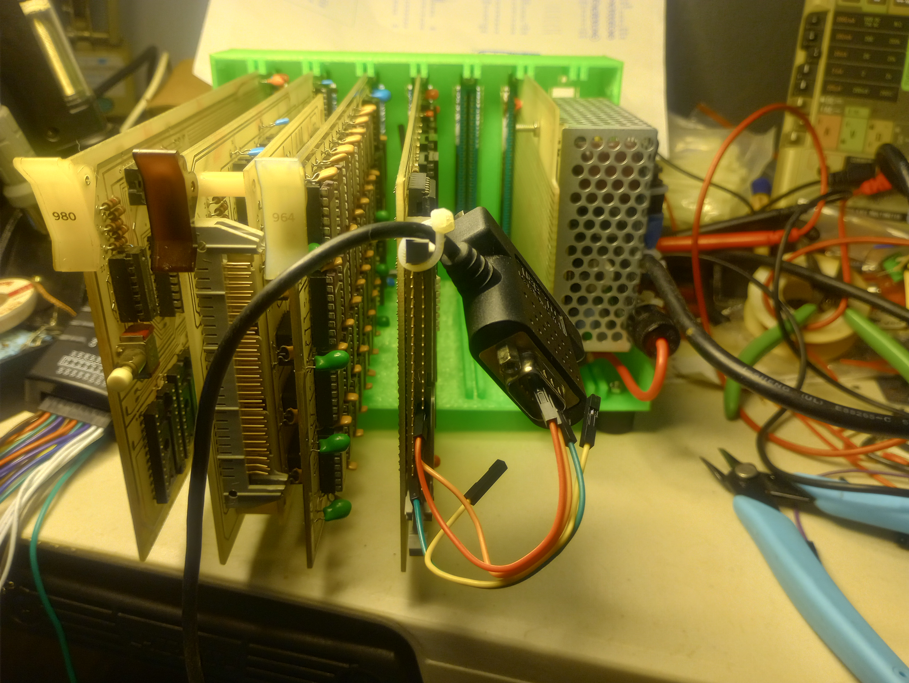

# BBLMCZ
MCZ clone using BBL boards

{content: }
The PROM monitor works:
>r
A  B  C  D  E  F  H  L  I  A' B' C' D' E' F' H' L'  IX   IY   PC   SP  
FF 00 00 10 00 28 60 00 00 00 F6 F4 DF D9 28 F5 55 E734 129E 0000 D218 
>

So far it loads the boot sector from track 23 sector 3 into memory:
>l
>d 1000 80
1000 03 04 05 06 07 08 09 0A 0B 0C 0D 0E 0F 10 11 12 *................*
1010 13 14 15 16 17 18 19 1A 1B 1C 1D 1E 1F 20 21 22 *............. !"*
1020 23 24 25 26 27 28 29 2A 2B 2C 2D 2E 2F 30 31 32 *#$%&'()*+,-./012*
1030 33 34 35 36 37 38 39 3A 3B 3C 3D 3E 3F 40 41 42 *3456789:;<=>?@AB*
1040 43 44 45 46 47 48 49 4A 4B 4C 4D 4E 4F 50 51 52 *CDEFGHIJKLMNOPQR*
1050 53 54 55 56 57 58 59 5A 5B 5C 5D 5E 5F 60 61 62 *STUVWXYZ[\]^_`ab*
1060 63 64 65 66 67 68 69 6A 6B 6C 6D 6E 6F 70 71 72 *cdefghijklmnopqr*
1070 73 74 75 76 77 78 79 7A 7B 7C 7D 7E 7F 80 81 82 *stuvwxyz{|}~....*
>

Now it needs a good boot disk...

{content: }

