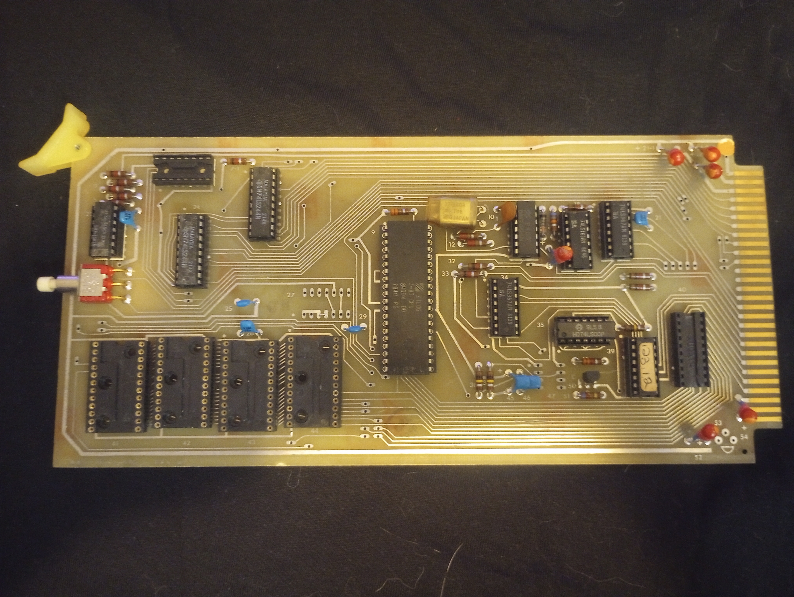
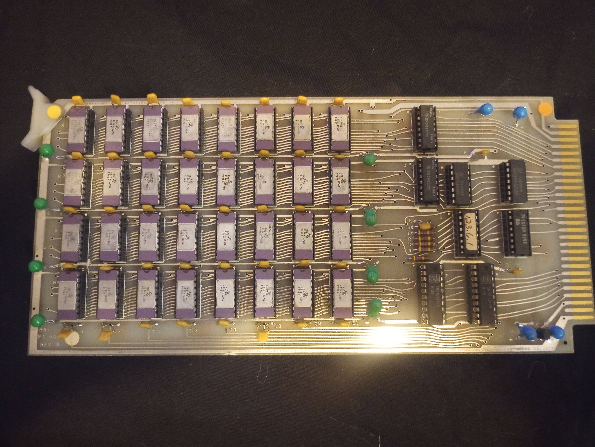
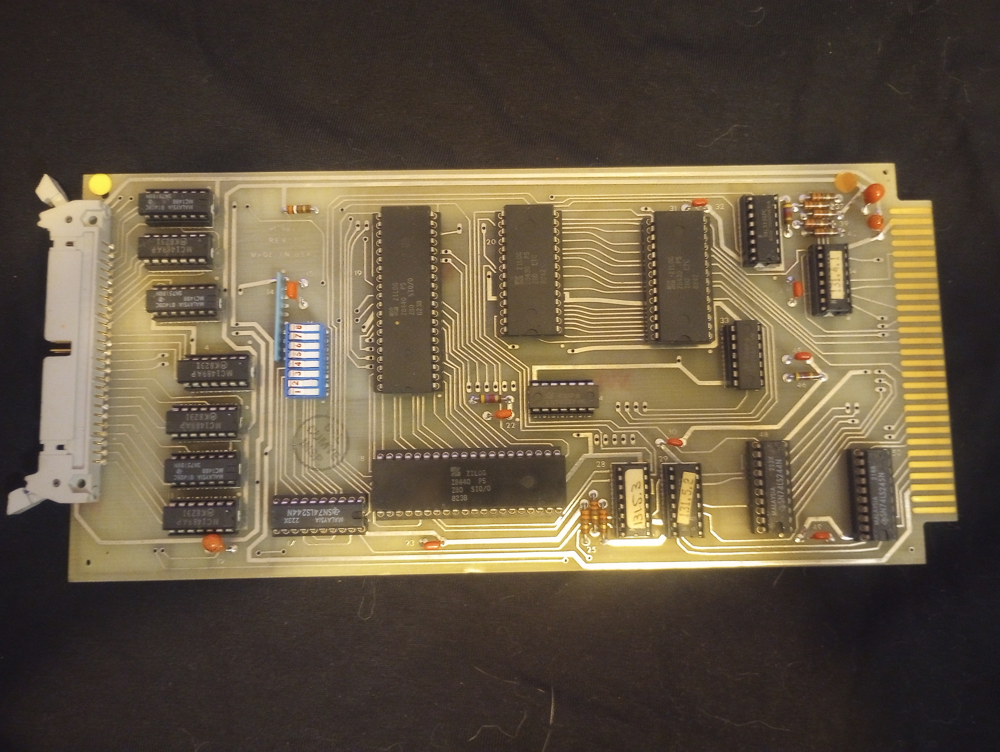
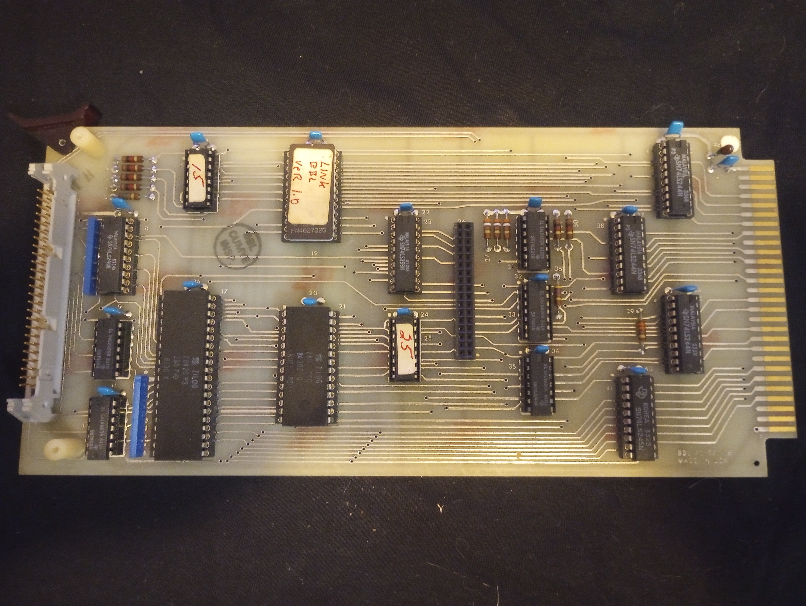
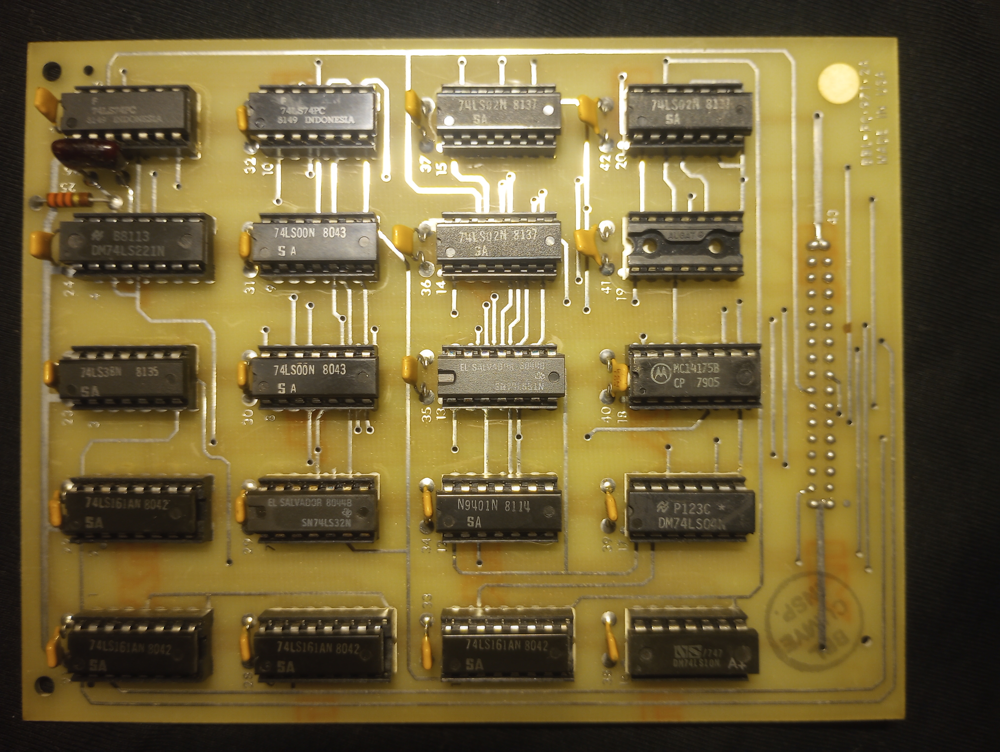
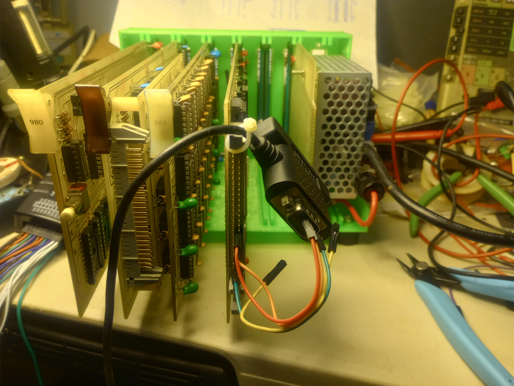
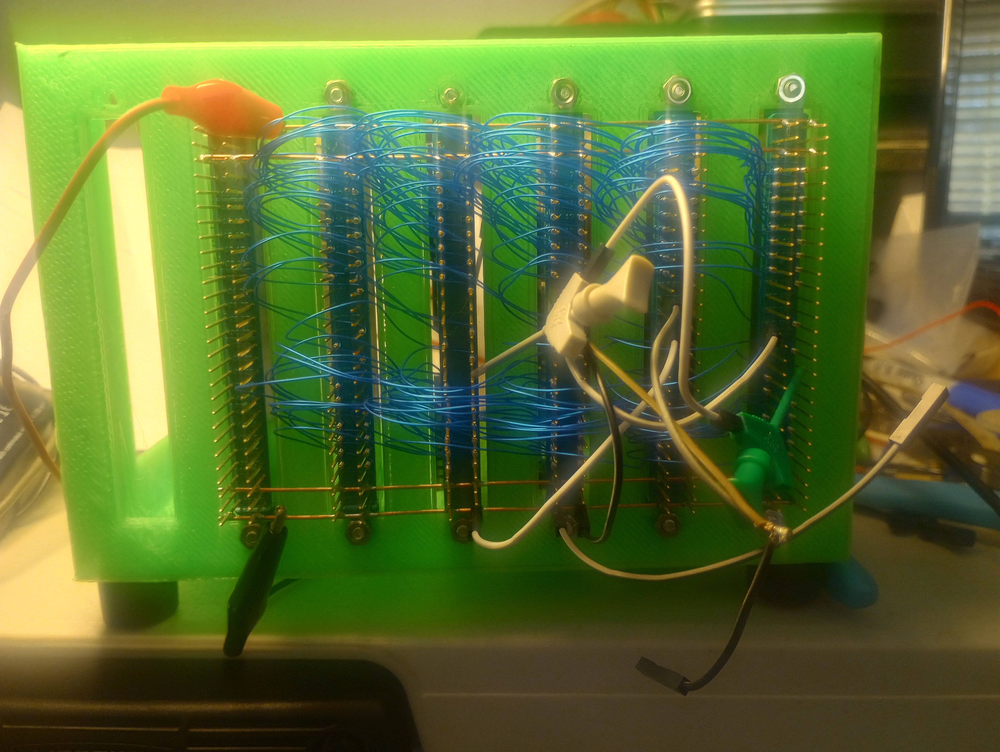

# BBLMCZ

My goal is to revive a computer that I used in the mid-80's. It was a beast in a 12U box and I couldn't keep
the power supplies and disk drives, but I was able to save the core circuit boards. Three of the four boards
came from the BBL System III paging system:

The PC980 Z80 CPU

The PC964 64K Dynamic RAM

The PC964 4-channel SIO

The fourth card was made custom for the BBL Computer System. It was nearly a direct clone of the Zilog MCZ
disk controller and monitor PROM:

The PC971 Disk Controller

It has a daughter card for the FM data separator. It has a missing chip for an additional hurdle:

The four cards in a crude cage:

The backplane is wire-wrapped like the original:

First milestone was to get the PROM monitor working:

    >r
    A  B  C  D  E  F  H  L  I  A' B' C' D' E' F' H' L'  IX   IY   PC   SP  
    FF 00 00 10 00 28 60 00 00 00 F6 F4 DF D9 28 F5 55 E734 129E 0000 D218 
    >

Time passes, figuring out how to get a disk drive connected and how to write it...

    So far it loads the boot sector from track 23 sector 3 into memory:
    >l
    >d 1000 80
    1000 03 04 05 06 07 08 09 0A 0B 0C 0D 0E 0F 10 11 12 *................*
    1010 13 14 15 16 17 18 19 1A 1B 1C 1D 1E 1F 20 21 22 *............. !"*
    1020 23 24 25 26 27 28 29 2A 2B 2C 2D 2E 2F 30 31 32 *#$%&'()*+,-./012*
    1030 33 34 35 36 37 38 39 3A 3B 3C 3D 3E 3F 40 41 42 *3456789:;<=>?@AB*
    1040 43 44 45 46 47 48 49 4A 4B 4C 4D 4E 4F 50 51 52 *CDEFGHIJKLMNOPQR*
    1050 53 54 55 56 57 58 59 5A 5B 5C 5D 5E 5F 60 61 62 *STUVWXYZ[\]^_`ab*
    1060 63 64 65 66 67 68 69 6A 6B 6C 6D 6E 6F 70 71 72 *cdefghijklmnopqr*
    1070 73 74 75 76 77 78 79 7A 7B 7C 7D 7E 7F 80 81 82 *stuvwxyz{|}~....*
    >

    Now it needs a good boot disk...

    Weeks later:

    BOOTED!

    >L
    INVALID HRDWR. CNTCT ZILOG

    That was the PROM's message, this is the OS boot:

    >OS
    INVALID HARDWARE. CONTACT ZILOG

    

